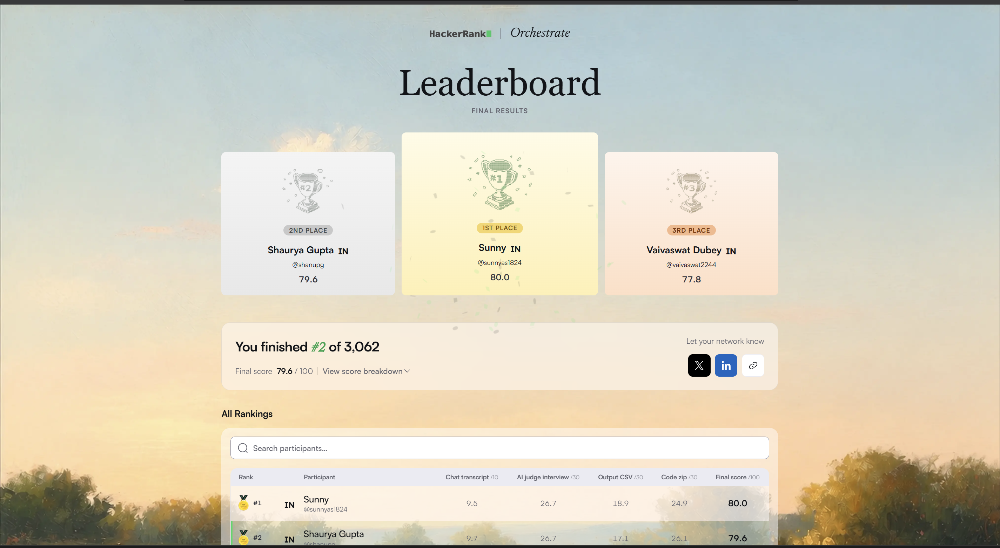

# 🥈 Buy or Wait? — AI Financial Agent

<p align="center">

## 2nd Place Globally — HackerRank Orchestrate September 2026

</p>

<p align="center">
  
</p>

This project placed **2nd globally** in the HackerRank Orchestrate September 2026 challenge.

---

## 🎯 Challenge

Build an AI-powered financial agent that determines whether a user can safely afford a requested expense.

The agent needs to reason about:

- Current and available funds
- Recurring expenses
- Pending payments
- Essential spending
- Confirmed income
- Payment options
- Financial information contained in messages
- Information extracted from images

---

## ✨ Highlights

* **Personalized affordability decisions** instead of simple balance checks.
* **Financial forecasting engine** that considers income, recurring expenses, pending payments, and minimum balance.
* **LLM-powered information extraction** from user messages and images to build financial context.
* **Payment planning system** that recommends full payment, partial payment, installments, waiting, or avoiding the purchase.
* **Evaluation pipeline** with multiple test cases, anomaly inspection, and validation of agent decisions.
* **Deterministic + AI architecture** where calculations remain reliable while AI handles unstructured information.


## 🧠 Core Approach

> **Let the LLM understand. Let the algorithm decide.**

The system separates language understanding from financial decision-making.

### LLM handles

- Extracting financial amounts from images
- Interpreting financial messages
- Identifying changes to financial events
- Generating the final explanation

### Deterministic code handles

- Financial calculations
- Affordability decisions
- Safe payment amounts
- Payment methods
- Earliest feasible payment dates
- Payment plans
- Validation

---

## 🏗️ Architecture

```text
User Request
     │
     ▼
Profile & Financial Data
     │
     ▼
Ledger Reconstruction
     │
     ├──────────────► Image Understanding
     │
     └──────────────► Message Understanding
                              │
                              ▼
                       Structured Effects
                              │
                              ▼
                      Financial Forecast
                              │
                              ▼
                     Affordability Engine
                              │
                              ▼
                     Payment Plan Selection
                              │
                              ▼
                          Validation
                              │
                              ▼
                         Explanation
```
🔧 Key Components
Financial Ledger

Reconstructs the user's financial state from available events and transactions.

Currency Normalization

Normalizes financial values using the relevant exchange-rate information.

Message & Image Understanding

Uses an LLM to convert unstructured information into structured financial effects.

Forecasting

Projects future income and spending to determine how much can safely be paid and when.

Affordability Engine

Deterministically calculates affordability status, safe payment amount, payment method, and earliest feasible payment date.

Payment Planning

Generates and validates possible payment plans against the financial forecast.

Validation & Evaluation

Uses automated validation and evaluation to detect incorrect outputs, regressions, and unsafe decisions.

💡 Key Takeaway

Using an LLM for every part of a financial decision is not necessarily the best approach.

A more reliable architecture is to use AI where interpretation is required and deterministic code where correctness matters.

AI handles ambiguity. Code handles certainty. Evaluation finds the gaps.

🏆 Result

2nd Place Globally
HackerRank Orchestrate — September 2026

The complete competition implementation is kept private. This repository is a public showcase of the project, architecture, and achievement.

🛠️ Tech Stack
Python
Large Language Models
Pandas
Deterministic financial calculations
Automated testing
Evaluation and regression testing
📁 Repository

This repository contains the public project showcase and competition result.

The full competition implementation is maintained separately and is not included here.

👤 Author

Shaurya Gupta